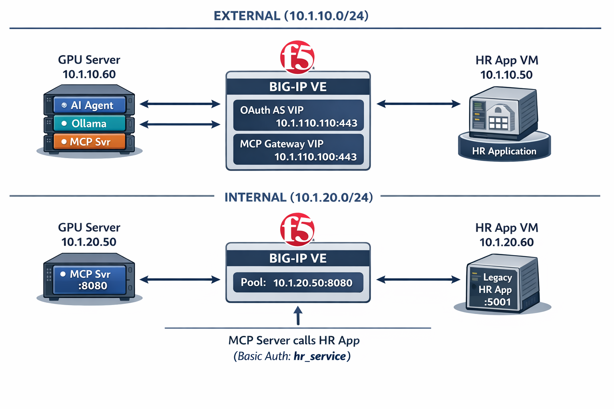

# Demo Guide — BIG-IP APM as MCP Gateway

**Audience:** Stakeholders, solution architects, and engineers running the demo.

---

## The Use Case

### Problem

Organizations are adopting AI agents that need access to internal systems —
HR databases, ticketing systems, financial records. These systems were built
years ago with legacy authentication (Basic Auth, API keys, NTLM). Rewriting
them for modern OAuth is expensive, risky, and slow.

Meanwhile, the **Model Context Protocol (MCP)** is emerging as the standard
for how AI agents discover and call tools. MCP mandates **OAuth 2.1** for
authentication on remote servers. This creates a gap:

```
AI Agent (speaks OAuth 2.1)  ←→  ???  ←→  Legacy App (speaks Basic Auth)
```

### Solution

**BIG-IP APM bridges this gap with zero changes to the legacy application.**

```
AI Agent (OAuth 2.1)  ←→  BIG-IP APM  ←→  Legacy HR App (Basic Auth)
```

BIG-IP APM acts as:

1. **OAuth Authorization Server** — Issues access tokens to the AI agent
2. **MCP Gateway** — Proxies MCP traffic (SSE streaming) to the backend
3. **Protocol Translator** — Validates OAuth tokens and allows authorized requests through

The legacy HR app never changes. It still runs Basic Auth as it has for years.
BIG-IP APM handles all the modern authentication on behalf of the agent.

### Business Value

- **No application changes** — Legacy apps are protected without rewriting them
- **Centralized policy** — One place to control who/what can access internal data
- **Audit trail** — Every agent request is authenticated, authorized, and logged
- **Zero Trust for AI** — Agents get scoped, time-limited tokens instead of hardcoded credentials
- **Future-proof** — When MCP becomes the standard, BIG-IP is already the gateway

---

## Architecture



### Network Topology

```
┌─────────────────────────────────────────────────────────────────────┐
│                        EXTERNAL (10.1.10.0/24)                      │
│                                                                     │
│   GPU Server              BIG-IP VE               HR App VM         │
│   10.1.10.60              10.1.10.10               10.1.10.50       │
│   ┌──────────┐     ┌──────────────────┐     ┌──────────────┐       │
│   │ AI Agent │────▶│ OAuth AS VIP     │     │              │       │
│   │ Ollama   │     │ 10.1.10.110:443  │     │              │       │
│   │ MCP Svr  │────▶│ MCP Gateway VIP  │     │              │       │
│   └──────────┘     │ 10.1.10.100:443  │     │              │       │
│                    └────────┬─────────┘     │              │       │
│                             │               │              │       │
├─────────────────────────────┼───────────────┼──────────────┼───────┤
│                        INTERNAL (10.1.20.0/24)                      │
│                             │               │              │       │
│   GPU Server              BIG-IP VE         │  HR App VM   │       │
│   10.1.20.50              10.1.20.100       │  10.1.20.60  │       │
│   ┌──────────┐     ┌──────────────────┐     │ ┌──────────┐│       │
│   │ MCP Svr  │◀────│ Pool:            │     │ │ Legacy   ││       │
│   │ :8080    │     │ 10.1.20.50:8080  │     │ │ HR App   ││       │
│   └──────────┘     └──────────────────┘     │ │ :5001    ││       │
│        │                                    │ └──────────┘│       │
│        └────────────────────────────────────┘─────▲───────┘       │
│                    MCP Server calls HR App               │         │
│                    (Basic Auth: hr_service)               │         │
└─────────────────────────────────────────────────────────────────────┘
```

### Component Summary

| Component | Location | Role |
|-----------|----------|------|
| **AI Agent** | GPU Server (container) | Asks questions, calls MCP tools, reasons with LLM |
| **Ollama + llama3.2:3b** | GPU Server (container) | Local LLM on Tesla T4 GPU — decides which tools to call |
| **MCP Server** | GPU Server (container) | Wraps the HR API as MCP tools (5 tools available) |
| **BIG-IP APM — OAuth AS** | VIP 10.1.10.110:443 | Issues OAuth tokens to the agent (ROPC grant) |
| **BIG-IP APM — MCP Gateway** | VIP 10.1.10.100:443 | Validates tokens, proxies SSE traffic to MCP server |
| **Legacy HR App** | HR App VM (container) | REST API with Basic Auth — 10 employees, 5 departments |

---

## Packet Flow — Step by Step

This is the complete flow when the agent answers: *"Who has TS/SCI clearance in the cybersecurity department?"*

### Phase 1: Authentication (OAuth Token Request)

```
Agent Container                    BIG-IP (10.1.10.110:443)
      │                                      │
      │  POST /f5-oauth2/v1/token            │
      │  grant_type=password                 │
      │  client_id=6c347e...                 │
      │  client_secret=107c08...             │
      │  username=mcp-agent                  │
      │  password=AgentPass2024!             │
      │  scope=mcp:tools                     │
      │─────────────────────────────────────▶│
      │                                      │
      │        APM Per-Session Policy:       │
      │        1. OAuth Logon Page           │
      │           (extracts username/pass)   │
      │        2. LocalDB Auth               │
      │           (validates against         │
      │            mcp-local-db)             │
      │        3. OAuth Authorization        │
      │           (issues token with         │
      │            scope mcp:tools)          │
      │                                      │
      │  200 OK                              │
      │  {                                   │
      │    "access_token": "2ef7db...",      │
      │    "token_type": "Bearer",           │
      │    "expires_in": 300,                │
      │    "scope": "mcp:tools"              │
      │  }                                   │
      │◀─────────────────────────────────────│
```

### Phase 2: MCP Connection (SSE through BIG-IP)

```
Agent Container          BIG-IP (10.1.10.100:443)        MCP Server (10.1.20.50:8080)
      │                           │                               │
      │  GET /sse                 │                               │
      │  Authorization:           │                               │
      │    Bearer 2ef7db...       │                               │
      │──────────────────────────▶│                               │
      │                           │                               │
      │    iRule: clientless-mode  │                               │
      │    (bypass APM redirect)  │                               │
      │                           │                               │
      │    Per-Request Policy:    │                               │
      │    1. OAuth Scope Check   │                               │
      │       - Mode: External    │                               │
      │       - Calls introspect  │                               │
      │         on 10.1.10.110    │                               │
      │       - Validates token   │                               │
      │       - Checks scope      │                               │
      │         "mcp:tools"       │                               │
      │    2. Token valid → Allow │                               │
      │                           │                               │
      │                           │  GET /sse                     │
      │                           │  (proxied to pool member)     │
      │                           │──────────────────────────────▶│
      │                           │                               │
      │                           │  200 OK                       │
      │                           │  Content-Type: text/event-    │
      │                           │    stream                     │
      │                           │◀──────────────────────────────│
      │  SSE: event: endpoint     │                               │
      │  data: /messages/?        │                               │
      │    session_id=abc123      │                               │
      │◀──────────────────────────│                               │
```

### Phase 3: Tool Call (Agent → MCP → HR App)

```
Agent        BIG-IP Gateway     MCP Server          HR App (10.1.20.60:5001)
  │               │                  │                        │
  │ POST /messages│                  │                        │
  │ Bearer token  │                  │                        │
  │ Tool: search_ │                  │                        │
  │  employees    │                  │                        │
  │ {department:  │                  │                        │
  │  cybersecurity│                  │                        │
  │  clearance:   │                  │                        │
  │  TS/SCI}      │                  │                        │
  │──────────────▶│                  │                        │
  │               │ Per-request      │                        │
  │               │ policy validates │                        │
  │               │ token again      │                        │
  │               │─────────────────▶│                        │
  │               │                  │                        │
  │               │                  │  GET /api/employees    │
  │               │                  │  ?department=          │
  │               │                  │   cybersecurity        │
  │               │                  │  &clearance=TS/SCI     │
  │               │                  │  Authorization:        │
  │               │                  │   Basic aHJfc2Vydm...  │
  │               │                  │───────────────────────▶│
  │               │                  │                        │
  │               │                  │  200 OK                │
  │               │                  │  {count: 3,            │
  │               │                  │   employees: [...]}    │
  │               │                  │◀───────────────────────│
  │               │                  │                        │
  │               │  SSE: tool result│                        │
  │               │◀─────────────────│                        │
  │  SSE: result  │                  │                        │
  │◀──────────────│                  │                        │
```

### Phase 4: LLM Reasoning (Local on GPU)

```
Agent Container                    Ollama (localhost:11434)
      │                                      │
      │  POST /api/chat                      │
      │  model: llama3.2:3b                  │
      │  messages:                           │
      │    - system prompt                   │
      │    - user question                   │
      │    - tool result (3 employees)       │
      │─────────────────────────────────────▶│
      │                                      │
      │        LLM processes on Tesla T4     │
      │        (GPU inference ~2-5 sec)      │
      │                                      │
      │  Final answer:                       │
      │  "The employees with TS/SCI          │
      │   clearance in Cybersecurity are:    │
      │   1. Sarah Chen                      │
      │   2. Rachel Torres                   │
      │   3. Alex Petrov (On Leave)"         │
      │◀─────────────────────────────────────│
```

### What the Stakeholder Should See

The agent:
1. **Authenticates** with BIG-IP (OAuth token in <1 second)
2. **Discovers tools** through the MCP Gateway (5 HR tools)
3. **Calls the right tool** with the right parameters (the LLM decides)
4. **Gets real data** from the HR system (not hallucinated)
5. **Delivers a structured answer** with actual employee names and details

All traffic flows through BIG-IP. The legacy HR app has no idea an AI agent
is talking to it — it just sees normal Basic Auth API requests.

---

## Pre-Flight Checks

Run these **before every demo** to ensure all components are healthy.

### From the GPU Server (10.1.1.5)

```bash
echo "=== 0. Start Services ==="
cd /mcp-bigip-gateway-lab && docker compose up -d

echo ""
echo "=== 1. Network Interfaces ==="
ip -br addr show ens6
ip -br addr show ens7

echo ""
echo "=== 2. HR App Reachable ==="
curl -s -o /dev/null -w "%{http_code}" -u hr_service:legacy_pass_2024 http://10.1.20.60:5001/api/health
echo ""

echo ""
echo "=== 3. Docker Containers ==="
cd /mcp-bigip-gateway-lab && docker compose ps --format "table {{.Name}}\t{{.Status}}"

echo ""
echo "=== 4. GPU Status ==="
nvidia-smi --query-gpu=name,memory.used,memory.total --format=csv,noheader

echo ""
echo "=== 5. Ollama Model Ready ==="
echo "Triggering model load and waiting for GPU VRAM..."
echo "(Tesla T4 cold-load can take 5-8 minutes on first boot)"
echo ""

# Trigger model load in the background — Ollama only loads on first request.
# keep_alive=24h pins the model in VRAM so later agent queries skip the cold load.
curl -s -m 600 http://localhost:11434/api/generate -d '{"model":"llama3.2:3b","prompt":"hi","stream":false,"keep_alive":"24h"}' > /dev/null 2>&1 &
CURL_PID=$!

READY=0
for i in $(seq 1 120); do
    VRAM=$(nvidia-smi --query-gpu=memory.used --format=csv,noheader,nounits 2>/dev/null | head -1)

    if [ "$VRAM" -gt 2000 ] 2>/dev/null; then
        echo "  [$i/120] Model loading into VRAM... ${VRAM}MiB"
    else
        echo "  [$i/120] Waiting for model load... VRAM: ${VRAM}MiB"
    fi

    # Check if the background request completed (model is ready)
    if ! kill -0 $CURL_PID 2>/dev/null; then
        VRAM=$(nvidia-smi --query-gpu=memory.used --format=csv,noheader,nounits 2>/dev/null | head -1)
        echo ""
        echo "Model loaded and ready! (VRAM: ${VRAM}MiB)"
        READY=1
        break
    fi

    sleep 5
done

if [ "$READY" = "0" ]; then
    kill $CURL_PID 2>/dev/null
    echo ""
    echo "WARNING: Model not ready after 10 minutes."
    echo "Check: docker compose logs ollama --tail 20"
    echo "The first agent query may be slow while the model finishes loading."
fi

echo ""
echo "=== 6. MCP Server Health ==="
curl -s -m 5 http://localhost:8080/sse | head -2

echo ""
echo "=== 7. BIG-IP OAuth Token ==="
DATA='grant_type=password&client_id=6c347e3dc69a6bd28477f4f1d8200ac620f091f1b4b7bd69&client_secret=107c0886f3835ed41978c954f766f72681c959ccb69e0ac620f091f1b4b7bd69&username=mcp-agent&password=AgentPass2024!&scope=mcp:tools'
curl -sk -X POST https://10.1.10.110/f5-oauth2/v1/token -d "$DATA" | python3 -c "import sys,json; d=json.load(sys.stdin); print(f'Token type: {d[\"token_type\"]}, Expires: {d[\"expires_in\"]}s')" 2>/dev/null || echo "FAILED"

echo ""
echo "=== 8. BIG-IP MCP Gateway ==="
TOKEN=$(curl -sk -X POST https://10.1.10.110/f5-oauth2/v1/token -d "$DATA" | python3 -c "import sys,json;print(json.load(sys.stdin)['access_token'])" 2>/dev/null)
RESULT=$(curl -sk -m 5 -H "Authorization: Bearer $TOKEN" https://10.1.10.100/sse 2>/dev/null | head -1)
if [ -n "$RESULT" ]; then echo "Gateway: OK ($RESULT)"; else echo "Gateway: FAILED"; fi

echo ""
echo "=== 9. PRM Discovery ==="
curl -sk https://10.1.10.100/.well-known/oauth-protected-resource | python3 -c "import sys,json; d=json.load(sys.stdin); print(f'Resource: {d[\"resource\"]}')" 2>/dev/null || echo "FAILED"
```

### Expected Results

| Check | Expected | If Failing |
|-------|----------|------------|
| 1. Interfaces | ens6=10.1.20.50, ens7=10.1.10.60 | `sudo systemctl restart lab-interfaces` |
| 2. HR App | `200` | Check HR App VM: `docker start legacy-hr-app` |
| 3. Containers | ollama, mcp-server Up | `docker compose up -d` |
| 4. GPU | Tesla T4 visible | Check NVIDIA drivers, container GPU access |
| 5. Model | "Model loaded and running!" with VRAM >4000MiB | Wait longer, or `docker compose exec ollama ollama run llama3.2:3b "hello"` |
| 6. MCP Server | `event: endpoint` | `docker compose restart mcp-server` |
| 7. OAuth Token | Token type: Bearer | Check APM access policy, LocalDB user |
| 8. MCP Gateway | Gateway: OK | Check VIP, per-request policy, iRule |
| 9. PRM | Resource URL shown | Check iRule on vs-mcp-gateway |

---

## Demo Commands

### Demo 1: Simple Employee Count

*Shows: basic tool calling, agent reasoning*

```bash
docker compose run --rm agent python agent.py "How many employees do we have?"
```

**Expected:** Agent calls `list_all_employees`, returns count of 10 with full roster.

### Demo 2: Security Clearance Query

*Shows: multi-parameter search, filtered results*

```bash
docker compose run --rm agent python agent.py "Who has TS/SCI clearance in the cybersecurity department?"
```

**Expected:** Agent calls `search_employees` with `department=cybersecurity` and
`clearance=TS/SCI`, returns 3 employees (Sarah Chen, Rachel Torres, Alex Petrov).

### Demo 3: Department Deep Dive

*Shows: multi-step reasoning, multiple tool calls*

```bash
docker compose run --rm agent python agent.py "Give me the full roster of the cybersecurity department with their clearance levels and hire dates"
```

**Expected:** Agent calls `get_department_roster` for cybersecurity, returns
detailed information about each team member.

### Demo 4: Cross-Department Query

*Shows: agent choosing the right tool for an open-ended question*

```bash
docker compose run --rm agent python agent.py "Which departments have the most employees?"
```

**Expected:** Agent calls `list_departments` and summarizes headcounts.

### Demo 5: Specific Employee Lookup

*Shows: precise tool usage with search parameters*

```bash
docker compose run --rm agent python agent.py "Search for an employee named Sarah Chen and give me her full details"
```

**Expected:** Agent calls `search_employees` with `first_name=Sarah` and
`last_name=Chen`, returns her full profile including title, clearance, and department.

> **Note:** The llama3.2:3b model may occasionally pick the wrong tool or pass
> incorrect arguments. If the query fails, rephrase to be more explicit about
> what to search for. The 8B model has better tool-calling accuracy but requires
> more GPU VRAM and load time.

---

## What to Highlight During the Demo

### For Stakeholders / Business Audience

1. **"Watch the Auth Mode line"** — Point out `Auth Mode: bigip` at startup.
   The agent is authenticating through BIG-IP, not directly.

2. **"The agent gets a real OAuth token"** — Show the `[AUTH] Token obtained`
   line. This is a standard OAuth flow, auditable and time-limited (300s).

3. **"The legacy app never changed"** — The HR app has been running Basic Auth
   for years. Nobody touched it. BIG-IP handles the translation.

4. **"The LLM decides what to ask"** — The agent doesn't have hardcoded queries.
   It reads the question, discovers available tools, and decides which one to
   call with which parameters. Try rephrasing questions to show flexibility.

5. **"Every request is authenticated"** — Show the `[TOOL] Calling:` lines.
   Each tool call goes through BIG-IP with the Bearer token. Invalid tokens
   are rejected.

### For Engineers / Technical Audience

1. **Show the token request:**
   ```bash
   DATA='grant_type=password&client_id=6c347e3dc69a6bd28477f4f1d8200ac620f091f1b4b7bd69&client_secret=107c0886f3835ed41978c954f766f72681c959ccb69e0ac620f091f1b4b7bd69&username=mcp-agent&password=AgentPass2024!&scope=mcp:tools'
   curl -sk -X POST https://10.1.10.110/f5-oauth2/v1/token -d "$DATA" | python3 -m json.tool
   ```

2. **Show token validation (valid vs invalid):**
   ```bash
   # Valid token — gets SSE data
   TOKEN=<paste a valid token>
   curl -sk -m 5 -H "Authorization: Bearer $TOKEN" https://10.1.10.100/sse

   # Invalid token — rejected (empty response)
   curl -sk -m 5 -H "Authorization: Bearer invalidtoken" https://10.1.10.100/sse

   # No token — rejected (empty response)
   curl -sk -m 5 https://10.1.10.100/sse
   ```

3. **Show the PRM discovery endpoint:**
   ```bash
   curl -sk https://10.1.10.100/.well-known/oauth-protected-resource | python3 -m json.tool
   ```
   This is the MCP spec's way for agents to discover where to authenticate.

4. **Show APM session logs** on BIG-IP:
   ```bash
   tail -20 /var/log/apm
   ```
   Point out: session creation, token issuance, scope authorization.

5. **Show direct mode vs BIG-IP mode** — Run the same query in both modes
   to prove the results are identical, but the auth path is different:
   ```bash
   # Edit docker-compose.yml: set AUTH_MODE=direct, MCP_SERVER_URL=http://mcp-server:8080/sse
   docker compose run --rm agent python agent.py "How many employees?"
   # Then switch back to AUTH_MODE=bigip
   ```

---

## Troubleshooting During Demo

### Agent hangs at "[LLM] Asking llama3.2:3b for next action..."

Ollama is loading the model on first request after container restart.
Wait 30-60 seconds. If it persists beyond 2 minutes:

```bash
docker compose logs ollama --tail 5
nvidia-smi
```

If `load_tensors` is timing out, restart Ollama:
```bash
docker compose restart ollama
```

### First run after boot fails with "Error in post_writer" / urlfilter_blocked

The first agent query after a reboot may fail with a 302 redirect to
`urlfilter_blocked.php3`. This is a timing issue — the APM session isn't
fully established when the MCP client sends its first POST request.

**Fix:** Simply re-run the same command. The second run will use the
established session and work normally. This only affects the very first
request after services start.

### Agent fails with "Failed to obtain OAuth token"

Token endpoint isn't responding. Check:
```bash
curl -sk https://10.1.10.110/f5-oauth2/v1/token -d "$DATA"
```

If you get a 302, the APM access policy needs the OAuth Profile set on the
access profile properties.

### Agent fails with SSL certificate error

The agent container can't verify BIG-IP's self-signed cert. Ensure the agent
was built with the latest code (`docker compose up -d --build agent`).

### Tool calls return errors

The MCP server can't reach the HR App. Check:
```bash
curl -u hr_service:legacy_pass_2024 http://10.1.20.60:5001/api/health
```

If unreachable, check interfaces:
```bash
ip -br addr show ens6
ip -br addr show ens7
sudo systemctl restart lab-interfaces
```

### No response from MCP Gateway (empty curl)

Per-request policy is rejecting. Check:
- Token hasn't expired (300s lifetime)
- Get a fresh token and retry
- Check APM logs: `tail -20 /var/log/apm` on BIG-IP

### 302 redirect to /my.policy

The `clientless-mode` header is missing from the iRule. Verify the iRule
`irule-mcp-prm` contains `HTTP::header insert "clientless-mode" 1` as the
first line in the `HTTP_REQUEST` event.

### Agent returns hallucinated data (wrong employee count, made-up names)

The tool call likely failed and the LLM guessed. Look at the `[TOOL] Result:`
lines in the output. If they show errors, the MCP server → HR App connection
is broken. Fix connectivity and re-run.

---

## Quick Recovery Commands

If something breaks during the demo, these commands reset the environment:

```bash
# Full restart of GPU server services
cd /mcp-bigip-gateway-lab
docker compose down
docker compose up -d
# Wait 30 seconds for model to load, then run demo

# Fix missing network interfaces
sudo systemctl restart lab-interfaces

# Fix HR App (run on HR App VM)
docker start legacy-hr-app

# Rebuild agent after code changes
docker compose up -d --build agent
```

---

## Lab vs Production Architecture

This lab simplifies the architecture for demo purposes. In a production
deployment, the security model would be tighter.

### What the Lab Does

```
Agent (Bearer token) → BIG-IP APM (validates token) → MCP Server → HR App
                                                        ↑
                                                  MCP Server holds its own
                                                  HR App credentials (env vars)
```

- The MCP server has `HR_API_USER` and `HR_API_PASS` hardcoded in its environment
- The MCP server calls the HR App with Basic Auth on its own
- BIG-IP validates the agent's OAuth token but does not inject credentials
- The MCP server accepts unauthenticated connections — anyone on the internal
  network could bypass BIG-IP and connect to it directly on port 8080

### What Production Would Do

```
Agent (Bearer token) → BIG-IP APM (validates token, injects Basic Auth) → MCP Server (requires Basic Auth) → HR App
```

- BIG-IP APM performs **credential translation** in the per-request policy:
  a Variable Assign action base64-encodes the service account credentials,
  then an HTTP Headers Modify action injects the `Authorization: Basic` header
- The MCP server **requires** authentication — it rejects any request without
  a valid Authorization header
- The MCP server does **not** hold credentials — it passes through whatever
  BIG-IP injects to the HR App
- The agent **cannot** bypass BIG-IP — it doesn't have the MCP server
  credentials, and the MCP server rejects unauthenticated connections
- BIG-IP is the **single enforcement point** — token validation + credential
  injection + audit logging

### Additional Production Considerations

- **BIG-IP 21.1 (Spring 2026)** — Adds native `client_credentials` grant and
  OAuth 2.1 support. This eliminates the ROPC workaround entirely — no local
  users, no OAuth Logon Page, no fallback branch quirk. The lab architecture
  stays the same, just simpler policy and proper OAuth 2.1 compliance.
- **External IdP (available today)** — Replace the local BIG-IP OAuth AS with
  Azure AD, Okta, or Ping Identity. Use `client_credentials` grant (which
  external IdPs support natively). BIG-IP becomes the resource server only.
- **Mutual TLS** — Add mTLS between BIG-IP and the MCP server so the MCP
  server only accepts connections from BIG-IP's client certificate.
- **Network segmentation** — Place the MCP server on a restricted VLAN that
  only BIG-IP can reach. No direct agent-to-MCP-server path exists.
- **Rate limiting** — APM can enforce rate limits per client, preventing
  a compromised agent from flooding the HR system with requests.
- **Scope-based access control** — Map different OAuth scopes to different
  tool subsets. An agent with `mcp:tools:read` can query but not modify;
  an agent with `mcp:tools:admin` gets full access.

---

## Key Talking Points

| Point | One-liner |
|-------|-----------|
| **No app changes** | The HR API hasn't been modified. It still runs Basic Auth. BIG-IP translates. |
| **OAuth for AI agents** | MCP mandates OAuth 2.1. BIG-IP APM is already an OAuth AS — day-one capability. |
| **Single pane of control** | APM logs every token issued, every tool called, every session created. |
| **Protocol translation** | APM has done SAML-to-Kerberos for 15 years. OAuth-to-Basic for AI agents is the same pattern. |
| **Zero Trust for AI** | Scoped tokens, time-limited access, per-request validation. No hardcoded credentials in the agent. |
| **Production path** | BIG-IP 21.1 (Spring 2026) adds native `client_credentials` + OAuth 2.1 — eliminates the ROPC workaround. Or use Azure AD/Okta as the IdP today. |
